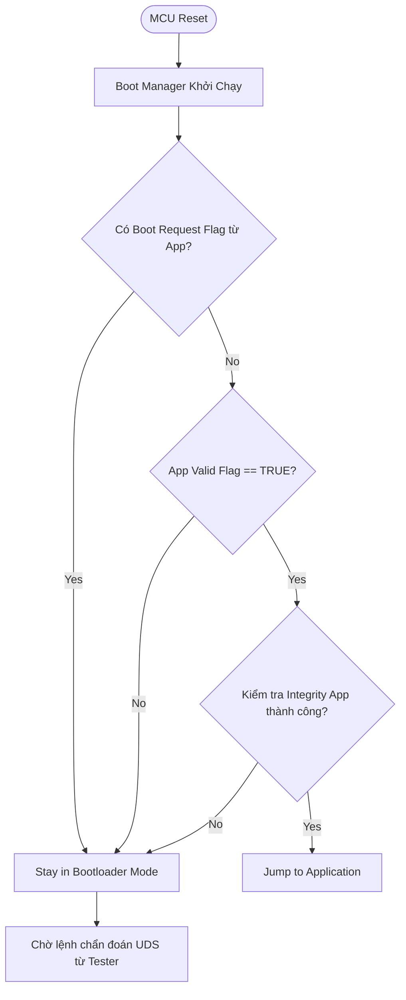
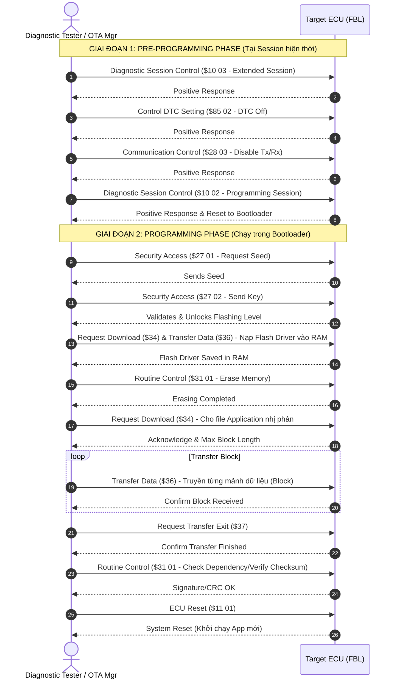

# CẨM NANG TOÀN TẬP VỀ FLASH BOOTLOADER (FBL) VÀ OVER-THE-AIR (OTA) UPDATE TRONG HỆ THỐNG AUTOMOTIVE

Tài liệu này tổng hợp toàn bộ kiến thức chuyên sâu từ cơ bản đến nâng cao về **Flash Bootloader (FBL)** và **Over-The-Air (OTA)** trong ngành công nghiệp ô tô (Automotive). Tài liệu được thiết kế dành cho các kỹ sư Embedded / Automotive Software nhằm ôn tập và nắm vững các mô hình kiến trúc, quy trình lập trình (programming sequence), các tiêu chuẩn quốc tế và các cơ chế an toàn/bảo mật.

> **Tài liệu liên quan:** [cam_nang_on_tap_c_automotive_middle-v2.md](file:///e:/Embeddelearning/LearningDoc/cam_nang_on_tap_c_automotive_middle-v2.md)

---

## MỤC LỤC
1. [Tổng Quan & Mối Quan Hệ Giữa FBL Và OTA](#1-tong-quan--moi-quan-he-giua-fbl-va-ota)
2. [Kiến Trúc Chi Tiết Flash Bootloader (FBL)](#2-kien-truc-chi-tiet-flash-bootloader-fbl)
3. [Quy Trình Nạp Phần Mềm Qua UDS (ISO 14229-1 Flashing Sequence)](#3-quy-trinh-nap-phan-mem-qua-uds-iso-14229-1-flashing-sequence)
4. [Bảo Mật & An Toàn Trong FBL (Safety, Security & HSM/EVITA)](#4-bao-mat--an-toan-trong-fbl-safety-security--hsmevita)
5. [Kiến Trúc Cập Nhật Phần Mềm Từ Xa Over-The-Air (OTA) & Điều Phối Hệ Thống](#5-kien-truc-cap-nhat-phan-mem-tu-xa-over-the-air-ota--dieu-phoi-he-thong)
6. [Các Module AUTOSAR Liên Quan Trong Flash Bootloader](#6-cac-module-autosar-lien-quan-trong-flash-bootloader)
7. [Truyền Tải Dữ Liệu Tốc Độ Cao (DoIP ISO 13400 & Tham Số CANTP)](#7-truyen-tai-du-lieu-toc-do-cao-doip-iso-13400--tham-so-cantp)
8. [Bảng So Sánh Diagnostics Flashing (Local) vs OTA (Remote)](#8-bang-so-sanh-diagnostics-flashing-local-vs-ota-remote)
9. [Bộ Câu Hỏi Phỏng Vấn Tuyển Chọn (Middle - Advanced Level)](#9-bo-cau-hoi-phong-van-tuyen-chon-middle---advanced-level)

---

## 1. TỔNG QUAN & MỐI QUAN HỆ GIỮA FBL VÀ OTA

Trong kỷ nguyên xe thông minh định nghĩa bằng phần mềm (Software-Defined Vehicles - SDV), khả năng cập nhật chương trình cho các hộp điều khiển điện tử (ECU) là bắt buộc. Có hai phương thức chính để nạp/cập nhật phần mềm:
*   **FBL (Flash Bootloader):** Là một chương trình chạy độc lập, nằm tại vùng nhớ an toàn của ECU. FBL chịu trách nhiệm giao tiếp vật lý (CAN, LIN, Ethernet...) và ghi dữ liệu nhị phân mới vào bộ nhớ Flash của ECU thông qua giao thức chẩn đoán (thường là UDS).
*   **OTA (Over-The-Air):** Là toàn bộ hạ tầng và quy trình phân phối bản cập nhật từ máy chủ đám mây (Cloud) xuống xe qua sóng di động/Wi-Fi mà không cần kết nối vật lý bằng cáp chẩn đoán.

```
+------------------+                   +-----------------------+                   +---------------+
|    Cloud OEM     | ---(Cellular)---> | Telematics / Gateway  | ---(Internal)---> |  Target ECU   |
| (OTA Server/PKI) |                   |  (OTA Orchestrator)   |      Bus          | (FBL/App Run) |
+------------------+                   +-----------------------+                   +---------------+
```

> **Mối quan hệ:** OTA không thay thế FBL. Thực chất, OTA là giải pháp cấp cao (System-level) để vận chuyển và quản lý file firmware, còn FBL là giải pháp cấp thấp (ECU-level) thực thi hành động "ghi" firmware đó vào ô nhớ Flash. Trong một chu trình OTA, Gateway/TCU tải file về và đóng vai trò như một Tester giả lập gửi các lệnh UDS xuống FBL của Target ECU để thực hiện việc flash.

---

## 2. KIẾN TRÚC CHI TIẾT FLASH BOOTLOADER (FBL)

### 2.1. Sơ đồ phân bổ bộ nhớ (Flash Memory Map)
Một ECU thông thường chia bộ nhớ Flash thành các phân vùng chính sau:

```
+-------------------------------------------------------------+ 0x0000_0000
| Reset Vector & Startup Code (Bootloader)                    |
+-------------------------------------------------------------+
| Boot Manager (Quyết định jump vào App hay ở lại Bootloader) |
+-------------------------------------------------------------+
| Flash Bootloader (Code xử lý giao tiếp UDS, Flash Driver)    |
+-------------------------------------------------------------+
| Boot Info / NVRAM (Lưu trữ các Flag, Boot Counter, App Valid) |
+-------------------------------------------------------------+
| Application Vector Table                                    |
+-------------------------------------------------------------+ 0x0001_0000 (Ví dụ)
| Active Application Code (Chương trình chạy chính)           |
+-------------------------------------------------------------+
| Calibration Data (Bản đồ dữ liệu động cơ, cấu hình xe...)  |
+-------------------------------------------------------------+
| RAM (Vùng nhớ chạy tạm thời, nơi nạp Flash Driver động)      | (SRAM)
+-------------------------------------------------------------+
```

### 2.2. Tiến trình khởi động (Startup Sequence)

Mỗi khi ECU reset (Power-on Reset, Software Reset, Watchdog Reset):
1.  **MCU Boot:** MCU bắt đầu thực thi code tại Reset Vector thuộc vùng của Bootloader.
2.  **Boot Manager Execution:**
    *   Kiểm tra tính hợp lệ của Application (`App Valid Flag` lưu trong NVM/Flash).
    *   Kiểm tra yêu cầu lập trình (`Boot Request Flag` được set bởi App trước khi reset).
    *   Tính toán Checksum/Signature của Application để kiểm tra tính toàn vẹn (Integrity Check).
3.  **Quyết định chuyển hướng (Jump Logic):**
    *   Nếu ứng dụng hợp lệ và không có yêu cầu cập nhật phần mềm -> Trỏ Program Counter (PC) tới địa chỉ khởi đầu của Application (`App Entry Point`).
    *   Nếu ứng dụng bị lỗi (Sai Checksum/Signature) hoặc có yêu cầu lập trình -> Giữ ECU ở chế độ Bootloader, khởi chạy các Driver giao tiếp và chờ lệnh từ Tester.



### 2.3. Khái niệm Flash Driver nạp động (Dynamic Flash Driver)
*   **Tại sao không lưu sẵn Flash Driver trong ROM của Bootloader?**
    *   **An toàn phần cứng (Safety):** Tránh việc vô tình thực thi code xóa/ghi Flash (Erase/Write) khi hệ thống gặp lỗi Memory Corruption hoặc nhiễu điện (Spurious write). Nếu không có sẵn Driver trong ROM, việc vô tình ghi đè lên Flash là bất khả thi.
    *   **Tối ưu tài nguyên:** Giảm dung lượng ROM của Bootloader.
*   **Cơ chế hoạt động:**
    1.  Tester gửi dữ liệu của Flash Driver (chứa các đoạn code ASM/C tối ưu để điều khiển thanh ghi Flash Controller) xuống RAM thông qua dịch vụ UDS `$34` (Request Download) và `$36` (Transfer Data).
    2.  Bootloader nhận dữ liệu này, lưu vào một vùng RAM được chỉ định có thuộc tính thực thi (Executable RAM).
    3.  Bootloader thực hiện xác thực chữ ký của Flash Driver để đảm bảo tính an toàn.
    4.  Khi có lệnh xóa/ghi Flash, Bootloader sẽ gọi (Jump to function pointer) mã lệnh chạy trực tiếp trên RAM.
    5.  Sau khi quá trình lập trình kết thúc (ECU reset), Flash Driver trên RAM sẽ bị xóa hoàn toàn.

---

## 3. QUY TRÌNH NẠP PHẦN MỀM QUA UDS (ISO 14229-1 FLASHING SEQUENCE)

Quy trình nạp phần mềm chuẩn cho một ECU theo tiêu chuẩn chẩn đoán **UDS (Unified Diagnostic Services)** được chia làm 3 giai đoạn chính:



### 3.1. Phân tích chi tiết các Giai đoạn (Phases)

#### Phase 1: Pre-Programming (Chuẩn bị hệ thống)
Giai đoạn này diễn ra khi Application cũ vẫn đang chạy. Mục đích là đưa mạng giao tiếp của xe vào trạng thái ổn định, không có các bản tin chẩn đoán khác gây nhiễu.
*   **`$10 03` (Extended Session):** Đưa ECU vào phiên chẩn đoán mở rộng.
*   **`$85 02` (DTC Setting Control - Off):** Tắt chức năng ghi mã lỗi (DTC). Do khi flash ta sẽ ngắt giao tiếp các hộp khác, nếu không tắt DTC, các ECU khác sẽ báo lỗi mất liên lạc.
*   **`$28 03` (Communication Control - Disable Rx & Tx):** Yêu cầu ECU ngắt gửi/nhận các bản tin ứng dụng thông thường (Application Messages) trên Bus, chỉ giữ lại kênh chẩn đoán.
*   **`$10 02` (Programming Session):** Chuyển sang phiên lập trình. ECU sẽ thực hiện Software Reset và khởi động lại vào **FBL**.

#### Phase 2: Programming (Ghi dữ liệu phần mềm mới)
Giai đoạn này diễn ra hoàn toàn trong môi trường **Bootloader**.
*   **`$27 01 / 02` (Security Access):** Xác thực Seed/Key. Đây là chốt chặn bảo mật ngăn chặn thiết bị lạ tự ý nạp code vào ECU.
*   **Download Flash Driver:** Nạp driver điều khiển bộ nhớ Flash vào RAM thông qua `$34` và `$36`.
*   **`$31 01 FF 00` (Erase Memory):** Kích hoạt Routine xóa các Sector Flash cũ chuẩn bị ghi App mới.
*   **`$34` -> `$36` -> `$37` (Download Sequence):**
    *   `$34` khai báo địa chỉ bắt đầu ghi và độ dài file App.
    *   `$36` truyền tuần tự các mảnh dữ liệu (Data Blocks).
    *   `$37` kết thúc truyền file.
*   **`$31 01 F0 01` (Verify Checksum/Signature):** Kích hoạt thuật toán kiểm tra tính toàn vẹn (CRC32, SHA-256) hoặc xác thực chữ ký số (RSA/ECDSA) để đảm bảo file nạp không bị lỗi truyền dẫn hay bị thay đổi trái phép.
*   **`$11 01` (ECU Reset):** Khởi động lại hệ thống để áp dụng phần mềm mới.

#### Phase 3: Post-Programming (Trả hệ thống về trạng thái ban đầu)
Giai đoạn này diễn ra sau khi ECU reset thành công và khởi động ứng dụng mới.
*   **`$28 00` (Enable Rx & Tx):** Mở lại giao tiếp mạng thông thường.
*   **`$85 01` (DTC Setting Control - On):** Bật lại chức năng ghi mã lỗi.
*   **`$10 01` (Default Session):** Đưa ECU về trạng thái vận hành mặc định.

---

## 4. BẢO MẬT & AN TOÀN TRONG FBL (SAFETY, SECURITY & HSM/EVITA)

### 4.1. Secure Boot vs Secure Flashing
Đây là hai cơ chế thường bị nhầm lẫn nhưng có nhiệm vụ bổ trợ cho nhau:
*   **Secure Flashing (Nạp bảo mật):**
    *   Mục tiêu: Đảm bảo phần mềm mới được nạp vào ECU phải có nguồn gốc tin cậy (Authentication) và nguyên vẹn (Integrity).
    *   Thực hiện: Kiểm tra chữ ký số (Signature Verification) của file nhị phân bằng khóa công khai (Public Key) lưu trong Bootloader trong quá trình flash (UDS `$31` Verify Signature).
*   **Secure Boot (Khởi động bảo mật):**
    *   Mục tiêu: Đảm bảo mã nguồn đang có sẵn trên Flash của ECU không bị can thiệp vật lý (Ví dụ: dùng máy nạp ROM ngoài ghi đè chip Flash).
    *   Thực hiện: Mỗi lần bật khóa điện (Power-on), MCU (thường thông qua phần cứng bảo mật HSM hoặc phần mã hóa của Bootloader) sẽ băm (Hash) toàn bộ vùng nhớ ứng dụng và so sánh với chữ ký được lưu trữ trước khi cho phép chạy CPU Core.

### 4.2. Vai trò của HSM (Hardware Security Module) & Tiêu chuẩn EVITA
Trong các thiết kế Automotive hiện đại, tác vụ mã hóa của Secure Boot và Secure Flashing không chạy trực tiếp trên nhân CPU chính (Application Core) mà được ủy quyền cho **HSM (Hardware Security Module)**.
*   **Kiến trúc phần cứng:** HSM là một co-processor độc lập (ví dụ: nhân ARM Cortex-M hoặc nhân bảo mật chuyên dụng) nằm trên cùng một tấm bán dẫn (die) với MCU chính, có bộ nhớ ROM/RAM riêng và bộ tăng tốc mã hóa phần cứng (AES, ECC, RSA, SHA).
*   **Lợi ích:**
    1.  **Isolation (Cô lập):** Application Core không thể truy cập trực tiếp vào vùng nhớ chứa Khóa bí mật (Private Keys/Root of Trust) của HSM.
    2.  **Performance (Hiệu năng):** Việc tính toán SHA-256 hay giải mã chữ ký ECDSA được thực hiện bằng phần cứng siêu tốc trên HSM, không làm nghẹt (block) chu kỳ chạy của ứng dụng chính.
*   **Tiêu chuẩn EVITA (E-safety Vehicle Intrusion Protected Applications):** Định nghĩa 3 cấp độ HSM trên xe hơi:
    -   *EVITA Full:* Dành cho các Telematics/Gateway ECU trung tâm. Hỗ trợ cả mật mã đối xứng, bất đối xứng và mạng bảo mật cao.
    -   *EVITA Medium:* Dành cho các Domain Controller chính (ECU động cơ, phanh). Hỗ trợ bảo mật mạnh nhưng tập trung hiệu năng trung bình.
    -   *EVITA Light:* Dành cho các cảm biến, cơ cấu chấp hành nhỏ (chỉ hỗ trợ mã hóa đối xứng AES để bảo vệ bus CAN).

### 4.3. Cơ chế xử lý lỗi khi đang Flashing (Fail-Safe Mechanisms)
*   **App Valid Flag:** Chỉ khi kiểm tra chữ ký số thành công ở bước `$31`, Bootloader mới set `App Valid Flag = TRUE`. Nếu mất nguồn giữa chừng, flag này giữ nguyên ở trạng thái `FALSE` (do đã bị xóa sạch trước khi xóa bộ nhớ ứng dụng ở đầu session).
*   **Watchdog Handling:** Watchdog Timer (WDT) phải được refresh liên tục thông qua một routine phục vụ ngắt riêng hoặc kick trực tiếp trong vòng lặp gửi dữ liệu chẩn đoán.
*   **Anti-Rollback Counter:** Lưu số phiên bản firmware (Version Counter) vào vùng OTP (One-Time Programmable) hoặc bộ nhớ ghi bảo mật của HSM. FBL sẽ từ chối nếu phiên bản file nhị phân mới thấp hơn phiên bản này nhằm chống lại cuộc tấn công hạ cấp (Rollback Attack).

---

## 5. KIẾN TRÚC CẬP NHẬT PHẦN MỀM TỪ XA OVER-THE-AIR (OTA) & ĐIỀU PHỐI HỆ THỐNG

Hệ thống OTA trong xe hơi yêu cầu sự điều phối nhịp nhàng từ đám mây xuống tới các vi điều khiển cấp thấp nhất.

### 5.1. Mô hình kiến trúc phân tầng (E2E OTA Architecture)

```
  [ Cloud OTA Server ]  <--- (Quản lý các bản Release, thiết lập chiến dịch OTA)
         |
         |  (Sóng di động 4G/5G, Giao thức HTTPS / MQTT)
         v
  [ Telematics Control Unit (TCU) / OTA Gateway ] (OTA Orchestrator / Master)
         |  - Tải gói cập nhật (.bin, .diff) về bộ nhớ đệm (External Flash / UFS)
         |  - Xác thực nguồn gốc gói cài đặt (Decrypt, Check Signature)
         |  - Chia nhỏ gói cài đặt gửi đi
         |
         +-------------[ Automotive Network: CAN-FD / Ethernet DoIP ]-------------+
         |                                                                        |
         v                                                                        v
  [ Target ECU 1 ] (Dual-Bank Flash)                                       [ Target ECU 2 ] (Single-Bank)
  - Tải App mới vào Bank phụ khi xe đang chạy.                            - Dừng xe, đưa về Bootloader
  - Swap Bank khi đỗ xe an toàn.                                          - Tiến hành flash truyền thống.
```

### 5.2. Các chiến lược cập nhật bộ nhớ (Memory Update Strategies)
*   **In-Place Update (Single-Bank):** Xóa App cũ và ghi đè trực tiếp App mới. Nhược điểm: Xe phải dừng hoạt động hoàn toàn (Downtime dài) và nguy cơ bị brick cao nếu mất nguồn.
*   **Dual-Bank Update (Active-Inactive Bank):** Chia đôi bộ nhớ Flash thành Bank A và Bank B. Tải ngầm App mới vào Bank phụ khi xe chạy bình thường (Background Download). Thực hiện hoán đổi (Swap) khi đỗ xe an toàn. 
    *   *Address Swapping (Phần cứng hỗ trợ):* Flash Controller của MCU tự động ánh xạ lại địa chỉ ảo. Biên dịch 1 file nhị phân duy nhất.
    *   *Boot Manager Redirection (Phần mềm hỗ trợ):* Boot Manager đọc cờ trạng thái hoạt động trong NVM và nhảy tới địa chỉ tương ứng của Bank chứa App mới. Yêu cầu mã độc lập địa chỉ (PIC).
*   **Delta Update (Cập nhật vi sai):** Chỉ gửi file chứa thông tin khác biệt (Delta File). OTA Gateway/Target ECU áp dụng thuật toán giải nén vi sai (`bsdiff/bspatch`, `Courgette`) kết hợp với bản cũ để phục dựng bản mới. Tiết kiệm tối đa băng thông truyền dẫn không dây.

### 5.3. Điều phối cập nhật cấp độ xe (Vehicle-Level Orchestration)
Trong một chu trình OTA của xe, việc cập nhật không chỉ diễn ra đơn lẻ mà thường là một chiến dịch phối hợp trên nhiều hộp (Multi-ECU Update).
*   **OTA Master (thường là Gateway hoặc TCU):** Chịu trách nhiệm lập kế hoạch, kiểm tra điều kiện an toàn toàn xe (Vehicle Safety Pre-conditions) trước khi cho phép flash:
    -   Tốc độ xe = 0 km/h.
    -   Cần số ở vị trí P (Park).
    -   Phanh tay điện tử (EPB) được kích hoạt.
    -   Điện áp ắc quy 12V $\ge$ 11.5V (tránh sụt nguồn giữa chừng).
    -   Nắp capo đóng.
*   **Parallel Flashing (Flash song song):** OTA Master có khả năng chạy song song nhiều session UDS tới các ECU thuộc các nhánh mạng khác nhau (ví dụ: một hộp trên mạng CAN-1, một hộp trên mạng Ethernet DoIP) để rút ngắn tổng thời gian downtime của xe.
*   **Đảm bảo tính nhất quán (Coherency Rollback):** Nếu có 3 ECU cần cập nhật đồng bộ để tương thích tính năng mới, nhưng có 1 ECU flash thất bại, OTA Master phải ra lệnh Rollback đồng loạt cả 3 ECU về phiên bản cũ để tránh lỗi không tương xứng phiên bản phần mềm (Version Mismatch).

---

## 6. CÁC MODULE AUTOSAR LIÊN QUAN TRONG FLASH BOOTLOADER

Trong kiến trúc chuẩn **AUTOSAR Classic**, Flash Bootloader được xây dựng bằng cách giản lược các tầng module nhằm tiết kiệm tối đa bộ nhớ ROM/RAM, nhưng vẫn tuân thủ mô hình phân lớp chuẩn:

```
+-----------------------------------------------------------------------------------+
|                           Application (Optional FBL App)                           |
+-----------------------------------------------------------------------------------+
|       Dcm (Diagnostic Communication Manager) / FblM (FBL Manager Layer)           |
+-----------------------------------------------------------------------------------+
|               Csm (Crypto Service Manager) / CryIf (Crypto Interface)             |
+-----------------------------------------------------------------------------------+
|   PduR (PDU Router)  |  MemIf (Memory Interface)  |    Fee (Flash EEPROM Emul.)   |
+----------------------+----------------------------+-------------------------------+
| CanTp / DoIP         |  Fls (Flash Driver)        |    Eep (EEPROM Driver)        |
+----------------------+----------------------------+-------------------------------+
| CanIf / EthIf        |                      Microcontroller (Hardware)            |
+-----------------------------------------------------------------------------------+
```

*   **Dcm (Diagnostic Communication Manager):** Module chịu trách nhiệm tiếp nhận và biên dịch các bản tin chẩn đoán UDS từ mạng xe. Nó trực tiếp xử lý các Session Control (`$10`), Security Access (`$27`), Request Download (`$34`), Transfer Data (`$36`), Request Transfer Exit (`$37`).
*   **FblM (Flash Bootloader Manager):** Lớp phần mềm chuyên biệt quản lý trạng thái lập trình, kiểm tra tính toàn vẹn của phần mềm (Checksum/Signature check) và phối hợp hoạt động chuyển tiếp giữa Bootloader và Application.
*   **Csm (Crypto Service Manager) & CryIf (Crypto Interface):** Cung cấp các hàm API chuẩn hóa để thực hiện việc kiểm tra chữ ký số (ECDSA/RSA) hoặc băm dữ liệu (SHA-256). Nó giao tiếp trực tiếp với Driver phần cứng mã hóa (Crypto Driver) của HSM để tăng tốc xử lý bảo mật.
*   **Fls (Flash Driver - MCAL Layer):** Module cấp thấp trực tiếp ghi/xóa các ô nhớ Flash vật lý. Trong FBL, module Fls thường được thiết kế để chạy trực tiếp trên RAM (sau khi được download động).
*   **Fee (Flash EEPROM Emulation):** Mô phỏng bộ nhớ EEPROM trên các Sector của Flash, giúp Bootloader lưu giữ các cờ trạng thái quan trọng (`App Valid Flag`, `Boot Request Flag`, `Boot Counter`) một cách bền vững mà không cần chip EEPROM ngoài vật lý.

### 6.1. Cấu hình Memory Mapping và Cơ chế Read-While-Write (RWW) trong AUTOSAR
Để phục vụ quá trình cập nhật phần mềm linh hoạt (FOTA) và thiết lập tách biệt giữa Bootloader với Application, AUTOSAR đặc tả các quy chuẩn khắt khe về sơ đồ ánh xạ bộ nhớ:

*   **Chia sẻ mã nguồn & Cơ chế Ánh xạ Ký hiệu (Symbol Mapping):**
    *   Khi FBL và Application cùng dùng chung mã nguồn của một số module (ví dụ: các module Driver chẩn đoán hoặc truyền thông), hệ thống bắt buộc phải cho phép định cấu hình ánh xạ các ký hiệu (symbol) biến/hàm vào các vùng nhớ vật lý khác nhau tùy ngữ cảnh build.
    *   Việc ánh xạ này được thực hiện thông qua các chỉ thị `#pragma` của trình biên dịch. Để chuẩn hóa và giữ mã nguồn độc lập với trình biên dịch, AUTOSAR sử dụng cơ chế định nghĩa thông qua các file tiêu chuẩn **`MemMap.h`**.
    *   Quy định đặt tên file MemMap:
        *   BSW Module: `{Mip}_MemMap.h` (với `{Mip}` là Module Implementation Prefix).
        *   Software Component: `{componentTypeName}_MemMap.h`.
    *   Mỗi kịch bản build độc lập (chẳng hạn như một build cho Bootloader và một build cho ECU Application) bắt buộc phải có **một bộ file MemMap riêng biệt**.
    *   Các đoạn code/data được chỉ rõ thuộc các vùng phân vùng nhớ như: `CODE` (mã lệnh chính), `CALLOUT_CODE` (mã các hàm callout BSW), `CODE_FAST` (mã lệnh cần thực thi tốc độ cao trong RAM), `CONFIG_DATA` (dữ liệu cấu hình).

*   **Cơ chế Cập nhật Ngầm (Background FOTA) & Read-While-Write (RWW):**
    *   Quá trình tải và ghi phần mềm mới (FOTA) có dung lượng tính bằng Megabytes (MiB) thường do một user duy nhất (FOTA Manager) kiểm soát và thực hiện ghi ngầm dưới nền.
    *   Tiến trình ghi/xóa dữ liệu Flash mới này có thể kéo dài qua nhiều chu kỳ lái xe (driving cycles), được thiết kế để có khả năng **bị ngắt quãng (interruptible)** và **bị ưu tiên chạy trước (preemptable)** bởi các tác vụ thời gian thực của xe.
    *   Đặc biệt, hệ thống bộ nhớ phải hỗ trợ cơ chế **Read-While-Write (RWW)** (Đọc trong khi Ghi) bằng cách phân vùng bộ nhớ (Memory Partitioning/Abstraction). Điều này cho phép ứng dụng chính tiếp tục đọc dữ liệu/thực thi code tại phân vùng Flash này trong khi FOTA Manager đang thực hiện ghi đè dữ liệu mới vào phân vùng Flash khác, đảm bảo xe vẫn vận hành an toàn trong lúc cập nhật ngầm.

---

## 7. TRUYỀN TẢI DỮ LIỆU TỐC ĐỘ CAO (DoIP ISO 13400 & THAM SỐ CANTP)

Tốc độ truyền dữ liệu là yếu tố sống còn quyết định thời gian downtime khi flash. Một file firmware hiện đại có kích thước từ vài MB (cho MCU) đến hàng trăm MB / vài GB (cho Domain Controller).

### 7.1. Diagnostics Over IP (DoIP - ISO 13400)
DoIP cho phép truyền các bản tin chẩn đoán UDS thông qua cáp mạng **Ethernet** (tốc độ 100 Mbps hoặc 1 Gbps) thay thế cho mạng CAN/CAN-FD truyền thống (tốc độ chỉ từ 500 Kbps đến 5 Mbps).
*   **Cơ chế hoạt động:**
    -   Thiết bị chẩn đoán kết nối vật lý qua chân Ethernet của cổng OBD-II.
    -   Sử dụng giao thức TCP/IP để thiết lập liên kết.
    -   Quy trình **Routing Activation**: Tester gửi thông điệp yêu cầu kích hoạt định tuyến, DoIP Edge Node (thường là Gateway) xác thực và mở cổng định tuyến bản tin chẩn đoán từ Ethernet vào mạng nội bộ của xe.
*   **Hiệu quả:** Thời gian flash một ECU động cơ từ 30 phút trên mạng CAN truyền thống giảm xuống chỉ còn dưới 1-2 phút qua DoIP Ethernet.

### 7.2. Tối ưu tham số CANTP (ISO 15765-2)
Khi bắt buộc phải thực hiện flash qua mạng CAN, ta phải tối ưu hóa bộ tham số của lớp truyền tải **CANTP (CAN Transport Protocol)** nhằm tối ưu hóa băng thông truyền file chẩn đoán lớn (Multi-Frame).
Trong cấu trúc gửi gói tin chẩn đoán Multi-Frame, Tester gửi bản tin bắt đầu (First Frame - FF), ECU phản hồi bằng bản tin điều khiển luồng (Flow Control - FC). Trong bản tin FC, hai tham số quyết định tốc độ truyền là:
1.  **Block Size (BS):** Số lượng bản tin liên tiếp (Consecutive Frames - CF) mà Tester được phép gửi đi trước khi phải dừng lại chờ bản tin Flow Control tiếp theo từ ECU.
    -   *Tối ưu:* Đặt `BS = 0` (Tester gửi toàn bộ các khung Consecutive Frames liên tục không cần dừng lại chờ Flow Control giữa chừng) hoặc đặt `BS` lớn nhất có thể tùy thuộc vào dung lượng bộ đệm nhận (Rx Buffer) của ECU.
2.  **Separation Time (STmin):** Khoảng thời gian nghỉ tối thiểu giữa hai bản tin Consecutive Frames gửi liên tiếp từ Tester.
    -   *Tối ưu:* Cố gắng giảm cấu hình `STmin` về 0 (hoặc vài trăm micro-giây) để Tester đẩy khung dữ liệu đi với tốc độ tối đa của phần cứng. Tuy nhiên, nếu đặt `STmin` quá nhỏ mà CPU của ECU không xử lý kịp ngắt nhận, sẽ xảy ra lỗi tràn bộ đệm (Rx Buffer Overflow).

```
Tester (Sender)                    Target ECU (Receiver)
     |                                      |
     |---- First Frame (FF) --------------->|  (Thông báo tổng dung lượng file)
     |<--- Flow Control (FC) ---------------|  (Gửi kèm tham số: BS, STmin)
     |                                      |
     |---- Consecutive Frame 1 (CF) ------->| \
     |                  <- STmin ->         |  |--- Gửi liên tiếp BS khung tin
     |---- Consecutive Frame 2 (CF) ------->|  |    mà không cần dừng lại
     |                  <- STmin ->         | /
     |---- Consecutive Frame N (CF) ------->|
     |                                      |
     |<--- Flow Control (FC) ---------------|  (Nếu BS > 0, yêu cầu gửi tiếp)
```

---

## 8. BẢNG SO SÁNH DIAGNOSTICS FLASHING (LOCAL) VS OTA (REMOTE)

| Đặc tính | Diagnostics Flashing (Local) | Over-The-Air (OTA) Update |
| :--- | :--- | :--- |
| **Kênh truyền dẫn** | Kết nối cáp vật lý (OBD-II port) | Sóng không dây (Cellular 4G/5G, Wi-Fi) |
| **Giao thức chính** | UDS (ISO 14229) trên nền CAN/CAN-FD/DoIP | HTTPS, MQTT, WebSockets (Cloud-to-Gateway) |
| **Tác nhân điều phối** | Kỹ thuật viên dùng thiết bị Tester (Vector CANoe, ODIS...) | OTA Gateway / Orchestrator chạy ngầm trong xe |
| **Thời gian Downtime** | Xe phải nằm tại xưởng dịch vụ (Garage) suốt quá trình nạp | Rất ngắn (nếu dùng Dual-bank) hoặc thực hiện lúc đêm |
| **Chi phí triển khai** | Tốn chi phí nhân công, thời gian của khách hàng | Tiết kiệm chi phí vận hành nhưng đầu tư hạ tầng Cloud lớn |
| **Tiêu chuẩn bảo mật** | Seed/Key (UDS `$27`), Khóa phần cứng vật lý | PKI phức tạp, mã hóa E2E, TLS, chứng chỉ bảo mật |
| **Tiêu chuẩn chất lượng** | ISO 14229, HIS Bootloader | UNECE R156, ISO 24089 (SUMS), ISO/SAE 21434 |

---

## 9. BỘ CÂU HỎI PHỎNG VẤN TUYỂN CHỌN (MIDDLE - ADVANCED LEVEL)

### Q1: Tại sao Flash Driver không nên nằm cố định trong ROM của Bootloader mà phải nạp động vào RAM khi programming?
**Trả lời:** 
*   **Tính an toàn (Safety):** Bộ nhớ Flash của MCU ghi/xóa thông qua việc điều khiển các thanh ghi chuyên dụng (Flash Controller registers). Nếu code của Flash Driver nằm cố định trong ROM, khi xảy ra lỗi nghiêm trọng (như nhảy con trỏ ngẫu nhiên do nhiễu từ trường, lỗi phần mềm gây tràn ngăn xếp), MCU có khả năng nhảy trúng vào đoạn code ghi/xóa này, dẫn đến việc xóa sạch ứng dụng tự phát. Việc chỉ nạp Flash Driver vào RAM khi thực hiện phiên lập trình bảo mật chẩn đoán giúp loại trừ hoàn toàn rủi ro này.
*   **Khả năng nâng cấp (Upgradability):** Quy trình ghi/xóa bộ nhớ Flash (đặc biệt là điện áp, thời gian xung dòng ghi) phụ thuộc vào đặc tính vật lý của Flash bán dẫn. Nếu hãng sản xuất vi điều khiển nâng cấp hoặc phát hiện lỗi trong thư viện Flash Driver cũ, ta có thể dễ dàng sửa đổi Flash Driver ở phía Tester và gửi phiên bản mới xuống RAM mà không cần phải thay đổi mã nguồn của Bootloader đã được ghi chết trong ROM từ nhà máy.

### Q2: Cơ chế rollback hoạt động thế nào khi ứng dụng mới bị crash ngay sau khi cập nhật? (Watchdog + Boot Counter)
**Trả lời:**
Để phát hiện ứng dụng mới tải về chạy lỗi (ví dụ: bị crash liên tục trong vòng vài giây đầu sau khởi động) và khôi phục về phiên bản cũ, hệ thống áp dụng cơ chế **Boot Counter kết hợp Watchdog**:
1.  Khi quá trình cập nhật hoàn tất, ứng dụng mới tại Bank B được kích hoạt lần đầu. Boot Manager ghi vào bộ nhớ NVM các biến: `Boot_Try_Counter = 3` (Số lần thử khởi động tối đa) và `App_Stable_Flag = FALSE`.
2.  Boot Manager nhảy sang ứng dụng mới ở Bank B. 
3.  Nếu ứng dụng mới bị crash (chia cho 0, hardfault, Watchdog Reset) trước khi kịp set trạng thái ổn định:
    *   Hộp sẽ bị reset.
    *   Boot Manager khởi chạy lại, đọc thấy `App_Stable_Flag == FALSE` nên sẽ giảm `Boot_Try_Counter` đi 1 đơn vị (còn 2).
4.  Nếu quá trình này lặp lại liên tục cho đến khi `Boot_Try_Counter == 0`:
    *   Boot Manager xác nhận phiên bản mới ở Bank B bị lỗi nghiêm trọng.
    *   Nó tự động cấu hình lại cờ chỉ hướng, trỏ vùng nhảy ngược lại Bank A (phiên bản ổn định cũ).
    *   Thiết lập `App_Active_Bank = Bank_A`, khôi phục lại trạng thái hoạt động bình thường của xe và gửi báo cáo lỗi lên OTA Cloud.
5.  *Nếu ứng dụng chạy bình thường:* Sau khoảng 30 giây chạy ổn định, App sẽ tự động ghi đè giá trị `App_Stable_Flag = TRUE` và reset cờ `Boot_Try_Counter` về lại mặc định. Từ đây, phiên bản mới chính thức được công nhận.

### Q3: Sự khác biệt bản chất giữa Secure Boot và Secure Flashing?
**Trả lời:**
*   **Secure Flashing:** Xác thực tính hợp lệ của firmware **ngay tại thời điểm nạp**. Quá trình này được thực thi bởi Bootloader bằng cách dùng Khóa công khai (Public Key) lưu sẵn trong ECU để giải mã chữ ký đi kèm của file nhị phân mới truyền xuống. Nếu chữ ký không khớp, Bootloader từ chối ghi dữ liệu vào Flash.
*   **Secure Boot:** Xác thực tính hợp lệ của firmware **mỗi khi ECU khởi động**. Dù firmware có được nạp hợp lệ trước đó, nhưng nếu kẻ tấn công tháo chip Flash ra và nạp trực tiếp mã độc vào đó qua mạch nạp phần cứng (bỏ qua bước giao tiếp UDS/Bootloader), Secure Boot sẽ phát hiện ra. Trước khi chuyển quyền điều khiển cho App, Boot Manager (hoặc Hardware Security Module - HSM) sẽ tính toán mã băm của toàn bộ vùng Flash App và xác thực chữ ký của nó. Nếu phát hiện sự sai lệch, ECU sẽ khóa hệ thống hoặc chỉ cho phép chạy trong Safe-Mode.

### Q4: Thuật toán nén vi sai (Delta Update) hoạt động như thế nào trên vi điều khiển có tài nguyên RAM hạn chế?
**Trả lời:**
Các thiết bị di động (Smartphone) có dung lượng RAM lớn (nhiều GB) có thể dễ dàng giải nén file Delta bằng cách tải toàn bộ file cũ và file patch vào RAM để tạo dựng file mới. Nhưng vi điều khiển Automotive thường chỉ có vài trăm KB RAM.
Để giải quyết bài toán này, các thuật toán Delta cho Embedded (như Courgette chỉnh sửa) sử dụng cơ chế **Stream-based Reconstruction**:
*   File Delta được sinh ra bằng cách so sánh chi tiết mã máy. Nó chứa các chỉ thị dạng: "Copy $N$ bytes từ địa chỉ cũ $X$", hoặc "Chèn thêm chuỗi byte $Y$ này".
*   Khi chạy dưới ECU, OTA Gateway hoặc FBL sẽ đọc file Delta theo từng Block nhỏ. 
*   Bộ giải nén sẽ dùng RAM làm bộ đệm trung chuyển: Đọc dữ liệu tương ứng từ Bank cũ (đọc trực tiếp từ ROM Flash), kết hợp với dòng dữ liệu patch từ RAM, dựng thành mã máy mới và ghi ngay lập tức (Stream write) sang các Sector trống của Bank mới. Cơ chế này giúp lượng RAM tiêu thụ chỉ bằng kích thước của 1-2 Sector đệm (thường là 4KB - 8KB).

### Q5: Phân tích ưu và nhược điểm của 2 cơ chế Swap trong Dual-Bank Flash: Address Swapping (Hardware) và Boot Manager Pointer Redirection (Software).
**Trả lời:**
*   **Address Swapping (Hardware-based):**
    *   *Cơ chế:* MCU có mạch phần cứng tự động trỏ địa chỉ vật lý của Bank B về địa chỉ ảo 0x0000 của Bank A (sau khi set bit ghi nhận kích hoạt).
    *   *Ưu điểm:* Cực kỳ thuận tiện cho lập trình viên. Chỉ cần biên dịch (Compile) một file nhị phân duy nhất với bản đồ địa chỉ cố định. Flash Controller phần cứng tự xử lý việc chuyển vùng.
    *   *Nhược điểm:* Đắt tiền, chỉ có trên các dòng chip Automotive trung-cao cấp (ví dụ: Infineon AURIX TC3xx, ST SPC58...).
*   **Boot Manager Pointer Redirection (Software-based):**
    *   *Cơ chế:* Bộ nhớ logic của Bank A và Bank B nằm ở hai dải địa chỉ hoàn toàn khác nhau (ví dụ: Bank A ở `0x0002_0000` và Bank B ở `0x0012_0000`). Boot Manager lưu một con trỏ địa chỉ khởi chạy trong vùng NVM. Khi khởi động, nó đọc giá trị này và thực hiện lệnh gọi hàm (`indirect jump`) tới địa chỉ bắt đầu của Bank tương ứng.
    *   *Ưu điểm:* Hoàn toàn độc lập phần cứng, có thể triển khai trên bất cứ dòng MCU rẻ tiền nào.
    *   *Nhược điểm:* Phức tạp trong khâu build phần mềm. Lập trình viên phải tạo ra 2 bản build riêng biệt (một bản chạy tại địa chỉ Bank A, một bản chạy tại địa chỉ Bank B) hoặc phải cấu hình biên dịch mã nguồn dưới dạng không phụ thuộc địa chỉ (**PIC - Position Independent Code**), việc này làm giảm hiệu năng thực thi của CPU do luôn phải truy cập biến thông qua bảng dịch địa chỉ (GOT/PIC tables) và tốn thêm dung lượng bộ nhớ.

### Q6: Tại sao quá trình Verify Signature phần mềm ở cuối Programming Phase lại thường được thiết kế bất đồng bộ (Asynchronous Verification)?
**Trả lời:**
*   **Lý do:** Kích thước của file ứng dụng (Application binary) thường rất lớn (vài Megabytes). Việc tính toán hàm băm (Hash/SHA-256) trên toàn bộ vùng nhớ Flash này bằng CPU Core chính tốn rất nhiều thời gian (có thể mất từ vài giây đến hàng chục giây tùy thuộc vào tần số hoạt động của MCU).
*   **Hậu quả nếu chạy đồng bộ:** Nếu FBL thực hiện verify một cách đồng bộ (blocking mode), nó sẽ không phản hồi bản tin UDS chẩn đoán nào về cho Tester trong suốt thời gian tính toán. Điều này làm quá hạn bộ định thời chẩn đoán chuẩn **Session Timeout (P2 Server Time - thường là 50ms, hoặc P2* Server Time - thường là 5000ms)**, dẫn đến việc Tester nghĩ rằng ECU bị mất liên lạc và báo lỗi "Communication Timeout".
*   **Giải pháp (Asynchronous):**
    -   FBL gửi lệnh khởi động tiến trình Verify qua HSM (co-processor) hoặc phần cứng chuyên dụng.
    -   FBL lập tức phản hồi về phía Tester mã phản hồi tạm thời **NRC $78 (Negative Response Code: Request Correctly Received - Response Pending)** để thông báo "Tôi đã nhận được lệnh, đang xử lý và xin gia hạn thời gian phản hồi".
    -   Trong khi HSM chạy ngầm tính toán chữ ký, FBL vẫn chạy vòng lặp chính trên CPU để tiếp nhận và phản hồi các bản tin duy trì chẩn đoán (Tester Present) nhằm giữ session không bị ngắt. Sau khi HSM hoàn thành xác thực, FBL sẽ trả về kết quả Positive Response cuối cùng cho lệnh UDS `$31` khởi chạy trước đó.

### Q7: Phân biệt vai trò của Block Size (BS) và Separation Time (STmin) trong việc cấu hình Driver CanTp của FBL. Khi cấu hình sai sẽ dẫn đến hiện tượng gì?
**Trả lời:**
*   **Block Size (BS):** Là số lượng khung tin Consecutive Frames (CF) tối đa mà máy gửi được phép phát liên tục trước khi phải dừng lại chờ máy nhận (ECU) gửi một khung điều khiển luồng (Flow Control - FC).
*   **Separation Time (STmin):** Là khoảng thời gian tối thiểu máy gửi phải dừng nghỉ giữa các Consecutive Frames.
*   **Khi cấu hình sai:**
    -   *Nếu đặt `STmin` quá nhỏ (ví dụ = 0) và `BS` quá lớn (ví dụ = 0 - gửi vô hạn):* Tester sẽ bắn dữ liệu dồn dập vào bus CAN. Nếu CPU của ECU đang bận xử lý tác vụ ghi Flash hoặc buffer nhận của module MCAL Can/CanIf quá nhỏ, phần cứng của ECU sẽ không xử lý kịp ngắt nhận, dẫn đến **Tràn bộ đệm nhận (Rx Buffer Overflow)** và làm mất gói dữ liệu, gây lỗi phiên lập trình chẩn đoán (Diagnostic Session Aborted).
    -   *Nếu đặt `STmin` quá lớn (ví dụ = 10ms) và `BS` nhỏ (ví dụ = 8):* Quá trình truyền dữ liệu sẽ cực kỳ chậm. Đối với một file App lớn, thời gian nạp sẽ bị kéo dài gấp hàng chục lần, không đáp ứng được yêu cầu về thời gian xuất xưởng của nhà máy (End-of-Line programming time).

### Q8: Trình bày cơ chế bảo mật chống chèn ngược (Anti-Replay / Anti-Rollback) khi nâng cấp firmware qua OTA?
**Trả lời:**
Để chống cuộc tấn công hạ cấp (Downgrade Attack) - nơi kẻ tấn công chặn gói tin OTA chứa bản phần mềm cũ nhưng có chữ ký hợp lệ (chứa lỗ hổng bảo mật đã biết) để nạp đè lên phiên bản mới an toàn hiện tại, hệ thống sử dụng cơ chế **Anti-Rollback Counter**:
1.  Mỗi bản build phần mềm có một biến metadata là `Software_Version_Counter` (được ký kèm trong cấu trúc chữ ký số của file nhị phân).
2.  ECU có một bộ nhớ không bốc hơi bảo mật (Secure NVM hoặc thanh ghi đặc biệt trong HSM/OTP) chỉ lưu trữ giá trị `Local_Min_Version`.
3.  Khi FBL nhận gói tin cập nhật ở dịch vụ `$31 Verify Signature/Dependency`:
    *   FBL/HSM sẽ bóc tách giá trị `Software_Version_Counter` của file mới.
    *   So sánh: Nếu `Software_Version_Counter < Local_Min_Version`, FBL sẽ từ chối nạp và trả về lỗi chẩn đoán (NRC `$22` - Conditions Not Correct hoặc một mã Routine Error riêng).
4.  Nếu file mới hợp lệ và chạy ổn định, FBL/App mới sẽ tăng giá trị `Local_Min_Version` trong vùng nhớ an toàn lên bằng `Software_Version_Counter` của phiên bản vừa nạp. Kể từ lúc này, mọi phiên bản cũ hơn phiên bản vừa nạp đều bị từ chối vĩnh viễn.
